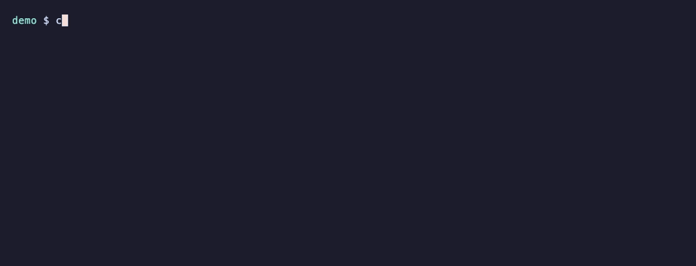

<h1>miniagent</h1>

**xAI's coding agent is 1,300,000 lines of Rust. Its user interface is bigger
than its agent.**

This is the **378-line spine** underneath — a working coding agent — and a map of
what the other 1,299,622 lines are actually for.

[](LICENSE)
[](pyproject.toml)
[](#the-numbers)
[](https://github.com/Ruthwik-Data/miniagent/actions/workflows/ci.yml)
[](#running-it)



*Real run. `calc.py` had a real bug, `pytest` really failed, the agent really
fixed it. Regenerate it: [`vhs demos/demo.tape`](demos/demo.tape).*

The map is **[REFERENCE.md](REFERENCE.md)**. The code is the exhibit.

---

## The whole agent

```python
messages = [system_prompt, user_prompt]
for turn in range(max_turns):
    reply = llm(messages, tools=SCHEMAS)
    if not reply.tool_calls:
        return reply.content           # the model stopped asking. it's done.
    for call in reply.tool_calls:
        result = dispatch(call)        # your code runs it, not the model
        messages.append(tool_result(call.id, result))
```

Everything in every coding agent ever shipped is quality, interface, or
distribution wrapped around those ten lines.

**The model never touches your machine** — it emits JSON requesting a call, your
code runs it. **Termination isn't your decision** — the loop ends when the model
stops asking. **Everything is resent every turn** — the model is stateless, and
the transcript is the only memory there is.

---

## What broke when we ran it

Three findings. **None was the one we predicted.**

#### The bug we shipped on purpose refused to fail

`edit_file` uses naive string matching, deliberately, to rediscover the problem
xAI built [hashline](REFERENCE.md#tools-edit-and-write) to solve — anchored
editing, three candidate schemes, an 887-line benchmark, shipped behind a
server-side flag.

Two attempts. Five sequential edits to the same line, no re-reads. `gpt-4o-mini`
tracked every one. **At this scale, with this model, it did not reproduce.**
→ [`stale-edit-did-not-fire.txt`](demos/stale-edit-did-not-fire.txt)

#### The bug we didn't know about was a feedback loop

`grep` searched `.miniagent/sessions/` — the transcript *being written by the loop
that was searching*. It fed the conversation back into itself: **142,984 tokens
against a 128,000 limit, in six turns.** Not drift. Recursion.

That's what grok's `gitignore.rs` is really for. It reads like politeness about
`node_modules`. It isn't — a search tool that can see the agent's own state is a
self-amplifying context bomb.
→ [`context-window-wall.txt`](demos/context-window-wall.txt)

#### The model lied about being finished

Asked to add a `--version` flag to its own CLI, it wedged a callback between a
decorator and its function, broke three tests, **never ran the code**, and
reported:

> *"I added a `--version` flag... using Typer's callback pattern."*

Nothing in a 378-line agent can catch that. Termination is
`if not reply.tool_calls: return`. **"Done" is the model's opinion.**

That is what grok's 202-line `goal_verifier_prompt.md` exists for — and it is not
a relic for weaker models. It's for this, on a current model, on a ten-line task.
→ [`self-modification.txt`](demos/self-modification.txt)

#### So we built the verifier. It didn't work.

If "done" is unreliable, check it: a second LLM pass with read-only tools that
runs the code before accepting the claim. grok's version is 202 lines of prompt
plus a planner, a strategist, and a sandbox. Ours is 40 lines
([`verify.py`](miniagent/verify.py), opt-in via `--verify`).

**Three attempts against the known failure. It never reached a verdict.**

| Attempt | What happened |
|---|---|
| 1 | Burned all 6 turns on `bash → exit 127` — `pytest` isn't on PATH |
| 2 | Told it about the venv. It tried to `edit_file` — **the judge modifying the evidence.** Made the tools read-only |
| 3 | Still used all 10 turns without ruling |

Meanwhile the agent degenerated: eight consecutive `2 matches found; old_string
must be unique`, then it abandoned `edit_file` and `write`-overwrote the whole
file. **Verification made things worse** — 18 turns instead of 6, more spend, a
more broken file.

**The finding:** the *idea* of a verifier is trivially reproducible in 40 lines.
The *reliability* is not — and the reliability is what grok's other 162 lines, the
planner, and the sandbox are buying. A judge with broken tools is worse than no
judge: it costs turns and returns nothing.
→ [`verifier-experiment.txt`](demos/verifier-experiment.txt)

---

## The numbers

| miniagent | code | total |
|---|---:|---:|
| **The spine** (6 files) | **378** | 683 |
| `verify.py` (the failed experiment) | 63 | 126 |
| **All** | **441** | **809** |

Tests: **51**, all offline, zero API spend.

~110 of the spine's 378 code lines are **JSON tool schemas** — data describing
tools to the model, not logic. All six tool implementations together are ~50
lines. Nearly half of every file is annotation explaining what grok does instead.

| grok-build | |
|---|---:|
| `xai-grok-pager` — the TUI | **414,627** |
| `xai-grok-shell` — agent runtime | 335,843 |
| `xai-grok-tools` | 112,275 |
| `xai-grok-workspace` | 76,730 |

**Their interface is larger than their agent.** Most of a production coding agent
is not intelligence, and not even agent design.

---

## What it deliberately doesn't do

No MCP. No subagents. No TUI. No streaming. No scheduling. No memory system. No
slash commands. No compaction. No sandbox. grok-build has every one.

**[REFERENCE.md](REFERENCE.md) says why none of them is the spine — that list is
the finding, not the backlog.** Sort grok's 1.3M lines by *why they exist* and
they split in two:

- **Bets on model weakness** — goal decomposition, verification, anchored editing,
  compaction. Should shrink as models improve. *They haven't yet* — see above.
- **Bets on human needs** — TUI, settings, sessions, MCP, crash handling. Nothing
  to do with model quality. **They grow forever**, and they're the bigger pile.

---

## What it's for

**Reading.** That's the primary use. 378 lines is small enough to hold in your
head in one sitting, and every non-obvious decision carries a note pointing at
what a 1.3M-line production agent does instead. If you want to know how coding
agents work, this is a shorter path than the blog posts and a much shorter path
than grok-build.

**A research bench.** The interesting one. `llm` is injectable and `--model` takes
any litellm string, so the same tasks run across providers and you can measure
the difference:

```bash
miniagent "fix the failing test" --model gpt-4o-mini
miniagent "fix the failing test" --model claude-sonnet-5 --verify
```

That's how the findings above were produced. It's a rig for asking *"how much
harness does this model actually need?"* — swap the model, hold the harness
fixed, watch what breaks.

**A library.** It's a package, not just a CLI:

```python
from miniagent.agent import run

text, messages = run("add type hints to utils.py", auto=True, max_turns=10)
```

**A base to extend.** Tools are a plain dict — adding one is a line and a schema:

```python
from miniagent.tools import TOOLS, SCHEMAS

TOOLS["deploy"] = lambda env: subprocess.run(["./deploy.sh", env]).returncode
SCHEMAS.append({"type": "function", "function": {"name": "deploy", ...}})
```

**Teaching.** The loop is legible, every tool call prints, and the whole thing is
testable with no API key.

### What it's not for

**Real work.** Use [Claude Code](https://claude.com/claude-code),
[grok](https://x.ai/cli), or Codex. They're better at every task listed above,
because ~1.3M of the lines this repo doesn't have are the ones that make an agent
trustworthy on a bad day — when the context is full, when the model is
confidently wrong, when the command is destructive, when the file moved.

Specifically, don't use it when:

- **The codebase is large.** No compaction. It hit 142,984 tokens against a
  128,000 limit in six turns and crashed.
- **You can't check the work yourself.** It will tell you it's done when it has
  broken your tests. That's documented above, not hypothetical.
- **The task needs more than ~20 turns.** `--max-turns` exists because there's
  nothing smarter underneath it.

**That gap is the whole point of the repo.** The 378 lines get you something that
works on a good day. The other 1,299,622 get you something that works on a bad
one — and every one of those failure modes was a paragraph in
[REFERENCE.md](REFERENCE.md) before it was a thing that happened here.

---

## Running it

```bash
python3 -m venv .venv && .venv/bin/python -m pip install -e ".[dev]"
export OPENAI_API_KEY=...
.venv/bin/miniagent "the tests are failing, fix them"
```

Any litellm model: `--model claude-sonnet-5`, `--model openrouter/...`

| Flag | Effect |
|---|---|
| `--auto` | Skip confirmation before `bash` |
| `--resume` | Continue the latest session here |
| `--session <id>` | Resume a specific session |
| `--model <str>` | Any litellm model string |
| `--max-turns <n>` | Cap loop iterations (default 25) |
| `--verify` | Second LLM pass checks the work before accepting "done" ([it doesn't work](#so-we-built-the-verifier-it-didnt-work)) |

```bash
.venv/bin/pytest    # 51 tests, 1.5 seconds, no API key
```

Every test runs against a `FakeLLM` returning scripted tool calls. **The loop's
correctness has nothing to do with the model, so it's tested without one** —
which is why the suite is free, why it's fast, and why CI needs no secrets. Same
move grok-build makes in its hashline benchmark, which measures an edit format
with no LLM in it at all: isolate the deterministic substrate and test *that*.

### Five of the 51 are scars

Tests that exist because something actually broke:

| Test | The bug it pins down |
|---|---|
| `grep_never_searches_the_agents_own_session_store` | `grep` found the transcript the running loop was writing and fed it back — 142,984 tokens in six turns |
| `bash_expands_tilde_in_cwd` | The model passed `cwd="~"`; `subprocess` doesn't expand it. This is what grok's `normalization.rs` is for |
| `verifier_cannot_edit_the_evidence` | The judge tried to `edit_file` the thing it was sent to inspect |
| `cli_prints_one_line_for_a_bad_api_key` | Was ~200 lines of litellm traceback to explain a one-line problem |
| `cli_exposes_the_documented_flags` | Two CI failures from a test that checked typer's help renderer — not code we own |

The other 46 were written from the plan and passed first try. **You can read this
project's history out of its test names.**

---

*Reference source: [xai-org/grok-build](https://github.com/xai-org/grok-build)
@ `b189869`, Apache 2.0. Every claim in [REFERENCE.md](REFERENCE.md) points at a
real path in that tree.*
